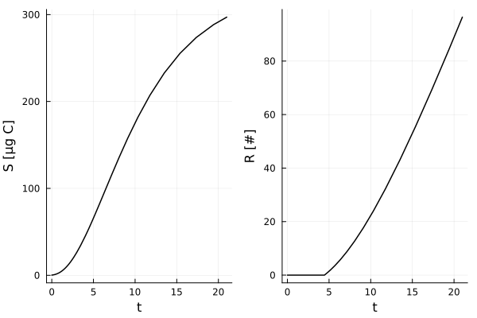

# The DEBBase.jl ecosystem: accessible and extensible simulation of life-history, population dynamics and stressor effects using Dynamic Energy Budgets

Simon Hansul, Andreas Focks

## Context

Models based on Dynamic Energy Budget theory are gaining increasing attention in environmental sciences, especially in combination with Toxicokinetic-Toxicodynamic (TKTD) models. DEB-TKTD models allow to extract information about the mechanisms of toxicity from life-history data, and to subsequently extrapolate the effects of chemical stressors from effects on the indivdual level to effects on population and community dynamics. As such, they are both valuable for basic scientific research and are of increasing interest for the application in environmental risk assessment. <br>

## Motivation

Several implementations of DEB and DEB-TKTD models exist. 
However, there is need for a accessible yet flexible implementation 
of DEB-TKTD models, which allows to efficiently simulate individual life-history 
as well as population dynamics. Furthermore, models should be modifiable within a clear framework, which should also enhance proper documentation and testing of these modifications. The DEBBase.jl ecosystem aims to provide such an implementation. <br> 

## Design principles

DEBBase.jl is designed to be lean and modular. 
That means, instead of providing as much functionality as possible in a single package, 
DEBBase.jl only provides the definition of a base model, default parameters and simulators for the base model. Simulations are either be executed by passing the model on to an ODE solver, 
or by passing them on to an individual-based simulation framework. This is a novel feature of DEBBase.jl compared to existing DEB-TKTD model implementations, since those focus either on simulating individual life-history (e.g. DEBtool, BYOM) or on simulating population dynamics (e.g. the Netlogo implementation by Martin et al. (2013)). <br>

Parameter estimation is outsourced to the separate DEBABC.jl, but other Julia packages could be used to perform parameter estimation (e.g. Optim.jl). Vice versa, DEBABC.jl can also be used to perform parameter estimation for models which are not part of DEBBase.jl.
DEBBase.jl can be used as a dependency to implement more specific DEB models, as we will later demonstrate using a DEB model for amphibians.

## Parameter structures

## Simulating life-history

With DEBBase.jl installed in the Julia environment, we can conduct a first simulation with just two lines of code:
```Julia
using DEBBase # load package
simout = simulator(BaseParamCollection()) # execute simulation with default parameters
```

Here, the first line loads the DEBBase package. The second line calls the `simulator` function, which takes an object of type `BaseParamCollection` as argument. 
This will assume a set of default parameters if no parameters are specified, as done above. <br>
The definition of `BaseParamCollections` in turn contains two fields:

- `glb`: An instance of type `GlobalBaseParams` which defines global parameters. These include quantities such as the timespan to simulate, nutrient input rates, and external chemical concentrations. The global parameters in combination define the environmental or experimental scenario to be simulated. The default values simulate life-history of the default DEB organism at *ad libitum* feeding conditions and without exposure to chemical stressors over a timespan of 21 days.
- `deb`: An instance of type `DEBBaseParams`, which defines the DEB and TKTD parameters. The default organism roughly approximates the growth and reproduction of *Daphnia magna*.

Figure 1 shows the growth and reproduction returned by the default parameter collection.

 <br>
*Figure 1: Structure $S$ and reproduction $R$ of the default organism in the default scenario.*

The default parameters can be modified by specifying exactly the parameters which should be modified, e.g:

```Julia
p = BaseParamCollection() # initialize default parameters
p.deb.kappa = 0.8 # modify a DEB parameter, kappa
simout = simulator(p) # execute simulation with modified kappa
```

This simulates the default parameters, except that the DEB parameter $\kappa$ (indicating the fraction of assimilated nutrients allocated to growth and somatic maintenance) is changed to 0.8 Alternatively, the following code achieves the same:

```Julia
simout = simulator(BaseParamCollection(deb = DEBBaseParams(kappa = 0.8)))
```

The same applies to global parameters, e.g. to set the food input rate:
```Julia
simout = simulator(BaseParamCollection(glb = GlobalBaesParams(Xdot_in = 800.)))
```

## Simulating effects of chemical stressors

The TKTD component is implemented so that mixtures with an arbitrary number of mixture components can be simulated. For this reason, TKTD parameters are stored as Vectors, where each element of the Vector represents a mixture component. Furthermore, we assume that each mixture component can act via arbitrary combinations of Physiological Modes of Action (PMoA), represented by a separate parameter Vector for each PMoA. The PMoAs are indicated by the suffixes G = decrease in growth efficiency, M = increase in maintenance costs, A = decrease in assimilation efficiency, R = decrease in reproduction efficiency, h = lethal effects according to GUTS-RED-SD. <br>

### TK Parameters 

In the case of the TK parameters, each element of the Vector ` is a scalar value, 
because we assume a simple TK model with a single parameter, the dominant rate constant $k_{D,z,j}$, specific for chemical stressor $z$ and PMoA $j$. The following would set the $k_{D,z,j}$-value for two stresors which both act via PMoA G:

```Julia
p = BaseParamCollection() # instantiate default parameter 
p.deb.k_D_G = [0.1, 1.0] # modify TK parameters for PMoA G
```

We can use `isolate_pmoas!` to ensure that all PMoAs which are not of interest are disenganged. This is achieved by setting the $k_{D,z,j}$-values for the disengaged PMoAs to 0.

```Julia
isolate_pmoas!(p, ["G"]) # make sure that all PMoAs expect G are disengaged
```

### TD Parameters

For the TD parameters, each element of the parameter Vector is a tuple, because we always need at least two dose-response parameters to model the effect of a stressor. By default, log-logistic relationships between the scaled damage $D_{z,j}$ and relative response $y_{z,j}$ are assumed. By conventions introduced in the DoseResponse.jl-package, the first parameter then indicates the sensitivity $e_{z,j}$ (equivalent to median effective damage for PMoAs G, A and R), whereas the second parameter corresponds to the slope $\beta_{z,j}$. 
The following code sets the TD parameters for two stressors acting via PMoA G:

```Julia
p = BaseParamCollection() # instantiate default parameter 
isolate_pmoas!(p, ["G"]) # disengage all PMoAs but G
p.deb.drc_params_G = [
    (1.0, 2.0), # log-logistic parameters for stressor 1 with respect to PMoA G
    (0.5, 3.0) # log-logistic parameters for stressor 2 with respect to PMoA G
    ] 
```

### Dose-response functions

By default, DEBBase.jl assumes a log-logistic relationship between the scaled damage $D_{z,j}$ and the relative response $y_{z,j}$. For PMoAs G, M and R, this is the well-known two-parameter log-logistic function:
$$
LL2(D_{z,j},\theta) = y_{z,j} = \frac{1}{1 + {\frac{D_{z,j}}{e_{z,j}}}^{\beta_{z,j}}} \\
\ \\
with \ j \in [G,A,R],\ \theta = (e_{z,j}, \beta_{z,j})
$$

For lethal effects, we need a monotonically increasing relationship between $D_{z,j}$ and the hazard rate $h_z$ with the origin at 0, which is given by the cumulative hazard function of the log-logistic distribution:
$$
LL2h(D_{z,h},\theta) = h_z = -ln \left( LL2D(D,\theta) \right) \\
\ \\
with\ \theta = (e_{z,h}, \beta_{z,h})
$$

For PMoA M, we need a monotonically increasing relationship with origin at 0, which we achieve by shifting $LL2h$:
$$
LL2M(D,\theta) = y_{z,M} 1 -ln \left( LL2D(D,\theta) \right) \\
\ \\
with\ \theta = (e_{z,M}, \beta_{z,M})
$$

We deviate here from previous DEB-TKTD implementations in two ways: We skip the "stress"-variable, because it serves no apparent purpose. Secondly, we replace the linear relationship between damage and stress with a log-logistic relationship (or one that is derived from it) due to practical and theoretical considerations (Hansul et al., 2023). <br>
However, the dose-response function for each stressor and PMoA is not hard-coded. Instead, the dose response-function is a parameter given in `DEBBaseParams`. 
Users can easily change the dose-response function by specification of the corresponding parameter:
```Julia
using DoseResponse # this package exports a colllection of dose response-functions (others can be defined by the user)
p = BaseParamCollection() # instantiate default parameter 
isolate_pmoas!(p, ["G"]) # disengage all PMoAs but G
p.deb.drc_functs_G = [
    LL2, # use log-logistic relationship for stressor 1
    NECneg # use linear relationship with threshold (NEC) for stressor 2
]
```
The general assumption for the dose response-function is that the returned value represents a relative response. I.e., to apply the effect of the stressor it can be multiplied with the corresponding term in the model without further transformations. 
PMoA-specific transformations (as given above for PMoA M) are part of the definition of the dose response-function. <br>
Naturally, users also have to consider that the parameters given in `drc_params_G` are then also only valid for the dose response-function for which they have been determined. <br>
This way of implementing dose response-functions has the advantage that users can seemlessly switch between TKTD model flavours. It allows to conduct model selection with alternative dose response-functions, which is not trivial to achieve with preexisting DEB-TKTD implementations, because the mathematical form of the dose response-function is usually hard-coded. <br>
For mixture effects, DEBBase.jl assumes independent action. That means, the combined effects of mixture components with shared PMoAs are given by the product of the relative responses.

## Parameter estimation using DEBABC.jl

DEBABC implements a Sequential Monte Carlo Approximate Bayesian Computation (SMC-ABC) algorithm (Toni et al., 2009), which can be used to estimate DEB(-TKTD) parameters and their associated uncertainties. <br>
In the default scenario, DEBABC.jl makes strict assumptions about the structure of the data. These are: 
- The data is given as a DataFrame
- The data frame contains four columns: Time `t`, structure `S`, cumulative reproduction `cR`, food input rate `Xdot_in`.
- The units of values in the columns match the model currencies, except for `cR`, which is given in number of offspring individuals. 
- The maximum structure reported roughly approximates the maximum structural mass which can be achieved by the organism.

A dataset adhering is referred to as base data, which can be indicated by use of the `BaseData` datatype (the only mandatory field of this type is the corresponding data frame).

Under these conditions, an estimation of DEB parameters can carried out easily:

```Julia
using DEBBase, DEBABC # load packages
data = CSV.read("data/calibration_data.csv", DataFrame) # read data from a file
abcresult = SMC(BaseData(data)) # estimate DEBBase parameters from base data
```


## Simulating population dynamics

Simulation of population dynamics can be achieved with the same basic mechanisms as simulation of individual life history:
```Julia
simout = simulator(IBMParamCollection())
```
The type `IBMBaseParams` has the same structure as `BaseParamCollection`, but defines some additional parameters (both within `glb` and `deb`) which are necessary to simulate population dynamics. The implementation makes use of multiple dispatch, so that the IBM implementation is called when `simulator` is called with `IBMParamCollection` as argument. <br>


## Extending the base model


## Accessibility


## Outlook

- Environmental factors, e.g. temperature
- Variable exposure concentrations
- Mixtures: Damage addition, combinations of DA and IA, interaction factors
- Sensitivity analysis

