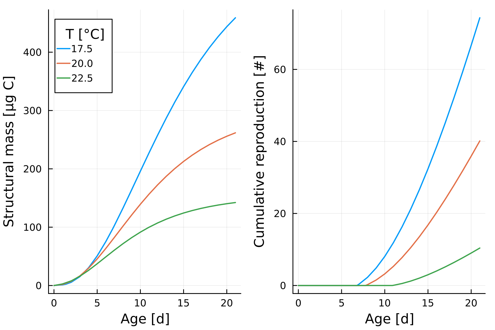

 
# Summary

The responses of organisms and populations to environmental stressors are the outcome 
of complex interactions within organisms, between organisms and with the environment, 
which can be unravelled and possibly predicted with dynamic models.
To this end Dynamic Energy Budget (DEB) theory provides a generic theory 
to model the life history of organisms and their responses to the environment. <br>
To this end, we developed the Julia package `DEBBase.jl`, which provides 
a relatively simple base model which can be either executed as system of differential equations 
or within an agent-based framework. 
This provides a basis to simulate the effects of chemical mixtures and other environmental factors,
such as temperature on isolated individuals as well as in populations.

# Statement of need

## Providing a seamless switch from individual-level to population-level

`DEBBase.jl` is a Julia package to simulate individuals and populations exposed 
to chemcial stressors. 
It defines a system of ordinary differential equations (ODE) which can be simulated directly 
using efficient solvers provided by `OrdinaryDiffEq.jl`, 
or be integrated into an agent-based model (ABM).

Performing extrapolations from the individual level to the population level (or higher) often requires to switch between modelling platforms, or to perform 
individual-level simulations in highly specialized agent-based modelling platforms which are not designed for the efficient solving of ODEs. <br>
`DEBBase.jl` provides a common API to simulate the ODE and ABM and data types
to organize and configure the large amounts of parameters which can be necessary in an DEB-ABM. <br>

`DEBBase.jl` aims to fill this gap by providing a more efficient workflow to simulate the same DEB model on different levels of biological organization. 

## Uncertainty propagation

As an additional feature, `DEBBase.jl` an implementation of a likelihood-free Bayesian parameter 
inference algorithm (**citation needed**), which can be used for relatively straightforward propagation of parameter uncertainties across levels of organization.

## Julia ecosystem

An appeal to implementing dynamic models in Julia is it's extensive scientific package ecosystem and 
good performance. As of now, there is no well-established Julia package for DEB-TKTD/DEB-ABM modelling, 
which is part of why we implemented `DEBBase.jl`.


## Comparison with other available software

The `debtool` package written in Matlab provides far more extensive functionality than `DEBBase.jl`, 
but does (to our best knowledge) not support agent-based simulations and is not designed for use 
with Bayesian parameter inference methods. <br>

The same can be said about the `byom`/`debtox` tool, also implemented in matlab. <br>
An agent-based implementation is available in Netlogo (**citation needed**). 
Netlogo does not have a package ecosystem which would be comparable to more general-purpose languages 
like Julia or Python. 

The Python package `mempyDEB` has a range of functionality which is similar to `DEBBase.jl`, 
but at poorer performance, especially for the ABM. 
Also, the ODE and ABM model variations by `mempyDEB` are independent. Changes made to the ODE system 
in `mempyDEB` need to be manually translated to the ABM to simulate a comparable system. 
This is not the case in `DEBBase.jl`.


## Methods 

### Model description 

A detailed description of the model is given in `SI_modeldescription`. <br>
In short `DEBBase.jl` provides a base model which is based on the DEBkiss model (**citation needed**). 
The base model includes a toxicokinetic-toxicodynamic (TKTD) component which allows to 
simulate an arbitrary number of chemical stressors in mixture, assuming combined effects 
to occur via independent action (IA), i.e. multiplication of the relative responses. <br>
The model can be simulated as system of differential equations or agent-based model. <br>

The default agent-based model makes some simplistic assumptions about aging, reproduction and starvation mortality (see model description and source code for details). 
These assumptions are sufficient to simulate plausible population dynamics, 
but need to be revisited for specific use cases.

### Parameter structures and defaults

The parameter sets for DEB-TKTD models can grow large, especially when dealing with mixtures 
and AMBs.

Parameters are therefore organized in a designated datatype (`AbstractParamCollection`). 
The default parameter collection `Params` contains the entries `glb`, `spc` and `agn`, all of which are `AbstractParams`. <br>
`glb` stands for *global* and contains the global parameters such as simulated timespan, resource input rate and temperature. <br>

`spc` stands for *species* and contains species-specific parameters. 
These are essentially the DEB and TKTD parameters. <br>

Upon initialization of a parameter structure, `glb` and `spc` contain default values, unless 
modified values were given as keyword arguments.

`agn` stands for *agent* and contains agent-specific parameters. These are used to induce individual variability, either in repeated simulations of the ODE or during simulation of population dynamics with the ABM. <br> 
Upon initialization of a parameter structure, `agn` has the value `nothing`. Users typically do not need to interact with `agn` directly, as this field is set internally upon initializaton of an agent.

## Running the base model

To run the base model, one can start by initializing the default parameters. <br>

```Julia
using DEBBase.DEBODE
p = Params()
sim = DEBODE.simulator(p)
```

This returns a data frame with all state variables over time. <br>
To simulate different environmental scenarios, the `p.glb` is modified. 
The code snippet below simulates five nutrient input rates (`Xdot_in`) and stores all results 
in a single data frame.

``` Julia
using DEBBase.DEBODE, DataFrames
p = Params() #
sim = DataFrame()
let Tvec = [17.5, 20., 22.5] # simulate three ambient temperatures
    for T in Tvec
        p.glb.T = 273.15 + T # succesively lower the food input rate
        sim_i = DEBODE.simulator(p) # generate the predidction
        sim_i[!,:T] .= T
        append!(sim, sim_i) #
    end
end
```

The output is visualized in Figure 1.


**Figure 1: Example simulation of the ODE system. Growth and reproduction are simulated at three temperatures for a hypothetical organism, using the default parameters and code provided in the main text.**


To take this to the population-level, in principle only need to change the simulator. 
Instead of `DEBODE.simulator`, we call `AgentBased.simulator`. <br>

For simulations of population dynamics we will tpyically want to include individual variability, which is done through the zoom factor `Z` (see model description for details). <br>
In addition, we might want to adjust some global parameters (longer simulation timespan and higher food input rate), by modify the `glb`-entries. <br>
Since the ABM is always stochastic, it is also a good idea to run repeated simulations. This can be done by manually writing a for loop, or with the `@replicates` macro.

```
using DEBBase.AgentBased, DataFrames, Distributions

p = Params()
p.glb.t_max = 56 # adjust simulated timespan 
p.spc.Z = Truncated(Normal(1, 0.1), 0, Inf) # induce individual variability 
p.glb.Xdot_in = 25_000 # provide more food 

Tvec = [17.5, 20., 22.5] # simulate these ambient temperatures
sim = DataFrame() # initialize output data frame
for (i,T) in enumerate(Tvec) # iterate over temepratures
    p.glb.T = 273.15 + T # update temperature in Kelvin
    sim_i = @replicates AgentBased.simulator(p) 10 # generate predictions
    sim_i[!,:T] .= p.glb.T # add column indicating temperature
    append!(sims, sim_i) # add result to output data frame
end
```


**Figure 2: Example simulation of the DEB-ABM. Population dynamics of a hypothetical organism are simulated at three temperatures , based on the default parameters. Thin lines represent individual simulations. Thick lines and ribbons show averages and the 5th to 95th percentile, respectively.**
